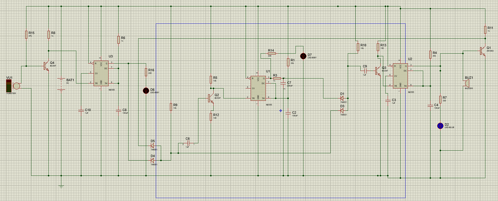

# 👏 Smart Double-Clap Security Activation System

<div align="center">

### 🔔 Intelligent Sound-Based Security Using Double-Clap Verification

Detects **two claps within 3 seconds** and activates an alarm while ignoring false triggers and additional claps during alarm operation.


</div>

---

## 📖 Overview

The **Smart Double-Clap Security Activation System** is a sound-controlled electronic security solution designed to improve reliability over traditional clap switches.

Instead of responding to every clap or random sound, the system verifies a specific sound pattern:

✅ First Clap Detected  
✅ 3-Second Verification Window Opened  
✅ Second Clap Detected Within Time Limit  
✅ Alarm Activated

If the second clap is not detected within the allowed time, the system automatically resets and waits for a new sequence.

To enhance stability, all clap inputs are ignored while the alarm is active, preventing unwanted retriggering.

---

## 🎯 Problem Statement

Traditional clap-operated systems often suffer from:

- False triggering due to environmental noise
- Accidental activation from a single clap
- Continuous retriggering during operation
- Lack of timing-based verification

This project addresses these challenges using multiple NE555 timer stages, signal conditioning circuits, and timing verification logic.

---

## ✨ Key Features

🔹 Double-Clap Authentication Mechanism

🔹 3-Second Verification Window

🔹 Noise and False Trigger Reduction

🔹 Alarm Lockout During Operation

🔹 Fully Hardware-Based Design

🔹 Low-Cost Implementation

🔹 Easy to Build and Maintain

🔹 Suitable for Security and Automation Applications

---

## ⚙️ System Workflow

```text
START
  │
  ▼
Wait for First Clap
  │
  ▼
Open 3-Second Window
  │
  ├── No Second Clap
  │         │
  │         ▼
  │      Reset
  │
  ▼
Second Clap Detected
  │
  ▼
Activate Buzzer
  │
  ▼
Ignore Additional Claps
  │
  ▼
Buzzer OFF
  │
  ▼
Return to Idle State
```

---

## 🛠️ Hardware Components

| Component | Quantity |
|------------|-----------|
| NE555 Timer IC | 3 |
| BC547 Transistor | 4 |
| 1N4001 Diode | 5 |
| LEDs | 3 |
| Buzzer | 1 |
| Microphone Sensor | 1 |
| Capacitors | Multiple |
| Resistors | Multiple |
| 9V Battery | 1 |

---

## 🔬 Working Principle

### Stage 1 – Sound Detection

A microphone sensor captures clap sounds and converts them into electrical pulses.

### Stage 2 – First Clap Processing

The first clap triggers a timing circuit that creates a 3-second monitoring window.

### Stage 3 – Verification

If a second clap arrives before the timer expires, the system validates the double-clap sequence.

### Stage 4 – Alarm Activation

The verified signal activates the buzzer and visual indicators.

### Stage 5 – Lockout Protection

While the alarm remains active, additional clap inputs are ignored to prevent retriggering and ensure stable operation.

---

## 📊 Circuit Diagram
<p align="center">
  
</p>

> Circuit designed and simulated using Proteus Professional.

```markdown

```

---

## 🚀 Applications

- Home Security Systems
- Sound-Controlled Alarms
- Intrusion Detection Systems
- Smart Room Automation
- Educational Electronics Projects
- Timing Circuit Demonstrations
- Electronic Security Prototypes

---

## 💡 Advantages

✔ Reliable Double-Clap Verification

✔ Reduced False Alarms

✔ Simple Hardware Architecture

✔ No Microcontroller Required

✔ Low Power Consumption

✔ Cost-Effective Design

✔ Easy Troubleshooting and Maintenance

---

## 🧪 Simulation Environment

| Tool | Purpose |
|--------|---------|
| Proteus Professional | Circuit Design & Simulation |
| NE555 Timer IC | Timing and Control |
| BC547 Transistor | Signal Amplification |
| Microphone Sensor | Clap Detection |

---

## 📈 Future Improvements

- Microcontroller-Based Version
- Adjustable Timing Window
- Wireless Notification System
- GSM Alert Integration
- IoT-Based Security Monitoring
- Mobile App Control

---

## 🎓 Educational Value

This project demonstrates practical applications of:

- Analog Electronics
- Timing Circuits
- Signal Processing
- Event-Based Logic
- Security System Design
- Sound-Controlled Automation

---

## 📄 Conclusion

The **Smart Double-Clap Security Activation System** provides a reliable and intelligent solution for sound-based security applications. By requiring two valid claps within a predefined 3-second interval and ignoring inputs during alarm operation, the system achieves higher accuracy, improved stability, and enhanced security compared to traditional clap-controlled circuits.

---

### 🌟 "Not every clap deserves a response—only a verified double clap earns access."
